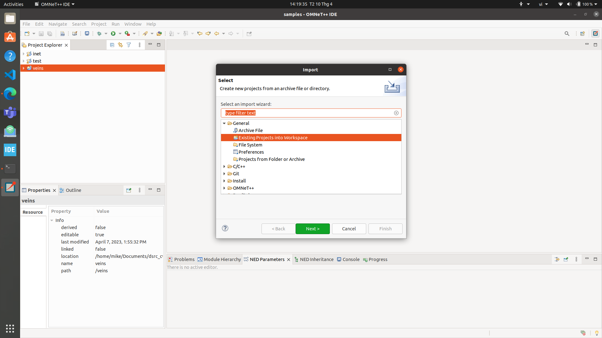
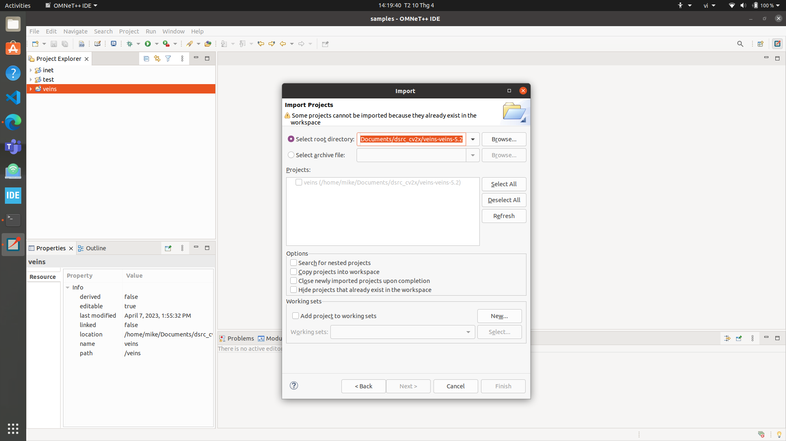
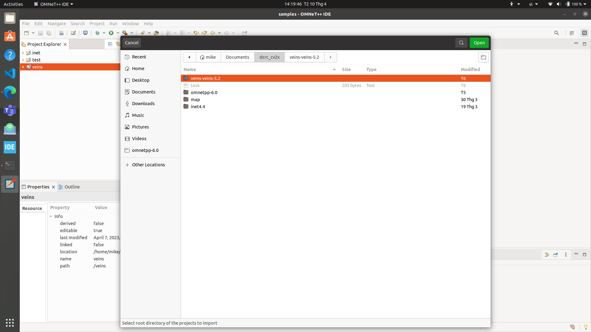

# Installing DSRC simulation tools on Ubuntu

## Download tools

## [VEINS](https://veins.car2x.org/download/)
## [OMNeT++](https://omnetpp.org/download/)
## [INET](https://inet.omnetpp.org/)

Before downloading, scroll in VEINS download to know the compatibility

# Installing OMNeT++ 
## Installing the prerequisite packets
> $ sudo apt install -f

> $ sudo apt update

> $ sudo apt-get install build-essential gcc g++ bison flex perl python python3 qt5-default libqt5opengl5-dev tcl-dev tk-dev libxml2-dev zlib1g-dev default-jre doxygen graphviz libwebkitgtk-1.0

> $ sudo apt-get install openscenegraph-plugin-osgearth libosgearth-dev

## Add environment variable
> $ cd omnetpp-6.0.1

> $ . setenv 

> $ gedit ~/.bashrc

### Add the path: export PATH=$PATH:/home/user/Downloads/omnetpp-5.4.1/bin

> $ sudo -s

> $ ./configure

> $ make

## Run OMNeT++

> $ omnetpp

# Add INET and Veins into OMNeT++

## INET
### File &rarr; Import &rarr; Existing Projects into Workspace &rarr; Next &rarr; Select root directory &rarr; Browse &rarr; inet4.4 &rarr; Finish
## VEINS
### File &rarr; Import &rarr; Existing Projects into Workspace &rarr; Next &rarr; Select root directory &rarr; Browse &rarr; veins-veins-5.2 &rarr; Finish

# Install SUMO

> $ sudo add-apt-repository ppa:sumo/stable

> $ sudo apt-get update

> $ sudo apt-get install sumo sumo-tools sumo-doc

# Run an example

Open file veins/examples/veins/omnetpp.ini

Right click &rarr; Run as &rarr; OMNeT++ Simulation / Click Run on Toolbar

Open terminal and run:

> $ '/home/mike/Documents/dsrc_cv2x/veins-veins-5.2/sumo-launchd.py' -vv -c '/usr/bin/sumo-gui'

Press F5 or click Run with full animation on Toolbar